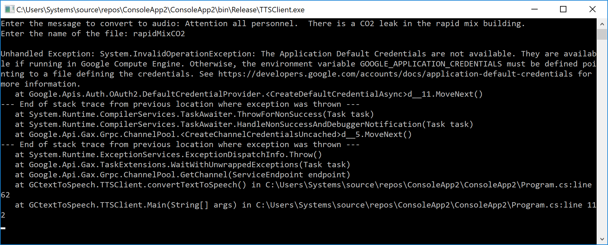

# TTSClient User Manual

## Text-to-Speech Client

The TTSClient program is used to synthesize text to speech over the internet using the Google Cloud Platform API.  The synthesized text will be saved on your local machine in the form of a WAV file.  The purpose of the application is to create paging messages for the Automated Paging System at both Plants.  

### Getting Started

These instructions will guide you in setting up the application and appropriate credentials.  Once completed, you should be able to generate audio files from any text.  This document will only cover the use of the executable program, not the source code for the application.  Refer to the commented source code for insights into how the program works.

#### Prerequisites

The TTSClient.exe application uses a service account created within a Google Cloud Platform account.  Anyone can create a free Google Cloud Platform account and set up a service account.  If the application is failing to authenticate with Google servers, having a valid service account is the first thing to verify.  The service account credentials are stored in a .json file on your local machine.  The following are prerequisites for using this application:

* A Windows-based computer to run the application on, it must have internet access (to hit Google servers, https://texttospeech.googleapis.com/)
* "TTSClient.zip" which contains the executable application and all accompanying additional library files (DLL, XML, and LIB files)
* .NET Framework 4.6.1
* A valid Google Cloud Services account with service account (SA) credentials set up and downloaded to your machine.  If you are missing the service account .json file or need to create a new one for whatever reason, there is a link at the bottom of this document that will walk you through creating a new SA key.

#### Installing

First you will need three files:

 1. **_TTSClient.zip_** which is the executable application and associated files
 2. **_texttospeech-26d5decff8fc.json_** which is the service account credentials for accessing the Google Cloud Speech Services
 3. **_NDP461-KB3102436-x86-x64-AllOS-ENU.exe_** which is the .NET Framework 4.6.1 installer

Copy these into a folder on your computer, then we'll install the .NET Framework 4.6.1 first:

 1. Double click the installation file, **_NDP461-KB3102436-x86-x64-AllOS-ENU.exe_**
 2. Walk through the installation wizard, if it is already installed you will receive a prompt stating it is already present.

We now have to modify the system environment variables to point to the .json service account file:  

 1. Open up *Control Panel*
 2. Click on *System*
 3. Click on *Advanced system settings*
 4. Click on *Environment variables*

Under the *System variables* section, click on *New* and enter the following strings:

```
Variable name: GOOGLE_APPLICATION_CREDENTIALS
Variable value: C:\TTSClient\tts\texttospeech-26d5decff8fc.json (replace this with your file location)
```  

Once you're finished, it will look something like this:


**Note that you will need to restart any command prompts or other applications for the path or environment variable changes to take effect.**

Finally, we need to extract the **_TTSClient.zip_** to a folder anywhere on your computer, for the purpose of the documentation I've used **_C:\TTSClient_**

### Synthesing text into WAV files

Once all of the prerequesites have been met and the installation is completed, you can run the **_TTSClient.exe_** located in the **_C:\TTSClient_** folder.  You will see the following prompt:


Input the text you want to synthesize to speech and press enter.  You can type in your text or copy and paste the text from a file into the prompt.  Next, enter the name of the WAV file, without the .WAV extension, that you would like the file to be saved as.  Press enter after you have input a filename.


From here, you can choose to synthesize another string of text into speech by pressing **_Y_** or exit the application by pressing **_N_**.


### Troubleshooting

If the application fails to start with the following error:


``` Check your internet connection, the application requires the ability to connect to Google servers and performs a check before starting ```

If the application fails to run with the following error:



``` There is an issue with the Google service account.  Check to make sure your environment variable is correctly pointing toward your .json service account credential file.  If it is, then you'll have to log into the Google Cloud Platform account that the service account is associated with and make sure it's got the correct permissions and has the API enabled. ```

If the application hangs and becomes unresponsive:

``` Make sure you've got .NET Framework 4.6.1 installed on your machine, it is required to use some of the libraries in the compiled application.  If this continues, you can load up the Visual Studio solution (source code) and attempt to compile and run the application.  Using debug mode, it will tell you why the application is hanging.  The source code is located on the NAS under the Glenmore folder.```

## Built With

* [Visual Studio 2017](https://visualstudio.microsoft.com/vs/) - Microsoft IDE for Windows Application programming
* [Markdown](https://daringfireball.net/projects/markdown/) - Shorthand syntax used to create user manual
* [.NET Framework 4.6.1](https://www.microsoft.com/net/download/dotnet-framework/net461) - Framework/library developed by Microsoft

## Authors

* **Jerrid Brown** - *Initial work, Version 1.0* 

## References used to build this application and documentation

* [Google Cloud Text-to-Speech API Documentation](https://cloud.google.com/text-to-speech/docs/) - Documentation for the Google Cloud Platform Text-to-Speech API
* [Google Cloud Platform](https://cloud.google.com/) - Account used to access and configure Google Cloud Platform Services
* [C# Documentation](https://docs.microsoft.com/en-us/dotnet/csharp/) - C# Documentation from Microsoft
* [Google Cloud SA documentation](http://cloud.google.com/linktoSAcreation) - Creation and management of a service account
